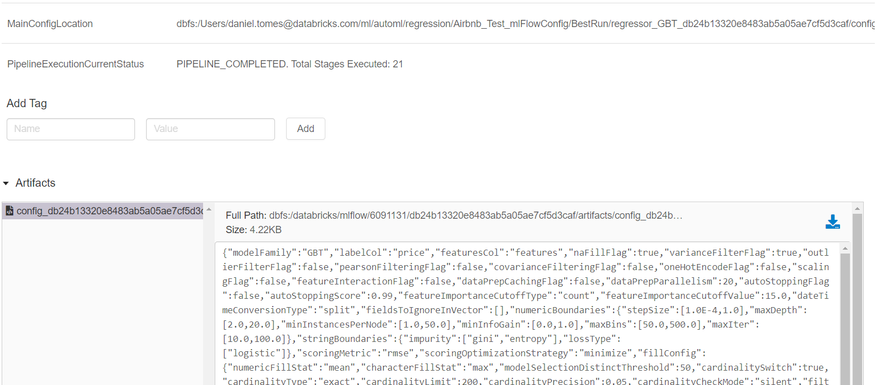

# Pipeline API for the AutoML-Toolkit 

The AutoML-Toolkit is an automated ML solution for Apache Spark.  It provides common data cleansing and feature 
engineering support, automated hyper-parameter tuning through distributed genetic algorithms, and model tracking 
integration with MLFlow.  It currently supports Supervised Learning algorithms that are provided as part of Spark Mllib.

## General Overview

The AutoML toolkit exposes the following pipeline-related APIs via [FamilyRunner](src/main/scala/com/databricks/labs/automl/executor/FamilyRunner.scala)

#### [Inference using PipelineModel](#full-predict-pipeline-api) |  [Inference using MLflow Run ID](#running-inference-pipeline-directly-against-an-mlflow-run-id-since-v061)

### Full Predict pipeline API:
```text
executeWithPipeline()
```
This pipeline API works with the existing configuration object (and overrides) as listed [here](APIDOCS.md), 
but it returns the following output
```text
FamilyFinalOutputWithPipeline(
  familyFinalOutput: FamilyFinalOutput,
  bestPipelineModel: Map[String, PipelineModel]
)
```
As noted, ```bestPipelineModel``` contains a key, value pair of a model family 
and the best pipeline model (based on the selected ```scoringOptimizationStrategy```)

Example:
```scala
import com.databricks.labs.automl.executor.config.ConfigurationGenerator
import com.databricks.labs.automl.executor.FamilyRunner
import org.apache.spark.ml.PipelineModel

val data = spark.table("ben_demo.adult_data")
val overrides = Map(
  "labelCol" -> "label", "mlFlowLoggingFlag" -> false,
  "scalingFlag" -> true, "oneHotEncodeFlag" -> true,
  "pipelineDebugFlag" -> true
)
val randomForestConfig = ConfigurationGenerator
  .generateConfigFromMap("RandomForest", "classifier", overrides)
val runner = FamilyRunner(data, Array(randomForestConfig))
  .executeWithPipeline()

runner.bestPipelineModel("RandomForest").transform(data)

//Serialize it
runner.bestPipelineModel("RandomForest").write.overwrite().save("tmp/predict-pipeline-1")

// Load it for running inference
val pipelineModel = PipelineModel.load("tmp/predict-pipeline-1")
val predictDf = pipelineModel.transform(data)
```

 
### Feature engineering pipeline API:
```text
generateFeatureEngineeredPipeline(verbose: Boolean = false)
```
@param ```verbose```: If set to true, any dataset transformed with this feature engineered pipeline will include all
                      input columns for the vector assembler stage
                      
This API builds a feature engineering pipeline based on the existing configuration object (and overrides) 
as listed [here](APIDOCS.md). It returns back the output of type ```Map[String, PipelineModel]``` where ```(key -> value)``` are
```(modelFamilyName -> featureEngPipelineModel)```

Example:
```scala
import com.databricks.labs.automl.executor.config.ConfigurationGenerator
import com.databricks.labs.automl.executor.FamilyRunner
import org.apache.spark.ml.PipelineModel

val data = spark.table("ben_demo.adult_data")
val overrides = Map(
  "labelCol" -> "label", "mlFlowLoggingFlag" -> false,
  "scalingFlag" -> true, "oneHotEncodeFlag" -> true,
  "pipelineDebugFlag" -> true
)
val randomForestConfig = ConfigurationGenerator.generateConfigFromMap("RandomForest", "classifier", overrides)
val runner = FamilyRunner(data, Array(randomForestConfig))
  .generateFeatureEngineeredPipeline(verbose = true)

runner("RandomForest")
.write
.overwrite()
.save("tmp/feat-eng-pipeline-1")

val featEngDf = PipelineModel
.load("tmp/feat-eng-pipeline-1")
.transform(data)
```

### Running Inference Pipeline directly against an MLflow RUN ID since v0.6.1:
With this release, it is now possible to run inference given a Mlflow RUN ID, 
since pipeline API now automatically registers inference pipeline model with Mlflow along with 
a bunch of other useful information, such as pipeline execution progress and each Pipeline 
stage transformation. This can come very handy to view the train pipeline's progress 
as well as troubleshooting. 

<details>
  <summary>Example of Pipeline Tags registered with Mlflow</summary>
  
  ## Heading
  An example of pipeline tags in Mlflow 
    
   
  And one of the transformations in a pipeline
    
</details>

#### Example (As of 0.7.1)
##### Model Pipeline MUST be trained/tuned using 0.7.1+ 
As of 0.7.1, the API ensures that data scientists can very easily send model to data engineering for production with
only an MLFlow Run ID. This is made possible by the addition of the full main config tracked in MLFlow. 
This greatly simplifies the Inference Pipeline but it also enables config tracking and verification much easier.
When `mlFlowLoggingFlag` is `true` the config is tracked on every model tracked as per 
[mlFlowLoggingMode](APIDOCS.md#mlflow-logging-mode).


Most teams follow the process:
* Data Science
    * Iterative training, testing, validation, review, tracking
    * Identification of model to move to production
    * Submit ticket to Data Engineering with MLFlow RunID to productionize model
    
* Data Engineering
    * Productionize Model

Below is a full pipeline example
```scala
// Data Science
val data = spark.table("my_database.myTrain_Data")
val overrides = Map(
  "labelCol" -> "label", "mlFlowLoggingFlag" -> true,
  "scalingFlag" -> true, "oneHotEncodeFlag" -> true
)
val randomForestConfig = ConfigurationGenerator.generateConfigFromMap("RandomForest", "classifier", overrides)
val runner = FamilyRunner(data, Array(randomForestConfig)).executeWithPipeline()

// Data Engineering
val pipelineBest = PipelineModelInference.getPipelineModelByMlFlowRunId("111825a540544443b9db14e5b9a6006b")
val prediction = pipelineBest.transform(spark.read.format("delta").load("dbfs:/.../myDataForInference"))
  .withColumn("priceReal", exp(col("price"))).withColumn("prediction", exp(col("prediction")))
prediction.write.format("delta").saveAsTable("my_database.newestPredictions")
```

MLFLow_Config_Tracking.png 

#### Example (Deprecated as of 0.7.1):
```scala
import com.databricks.labs.automl.executor.config.ConfigurationGenerator
import com.databricks.labs.automl.executor.FamilyRunner
import org.apache.spark.ml.PipelineModel
import com.databricks.labs.automl.pipeline.inference.PipelineModelInference

val data = spark.table("ben_demo.adult_data")
val overrides = Map(
  "labelCol" -> "label", "mlFlowLoggingFlag" -> true,
  "scalingFlag" -> true, "oneHotEncodeFlag" -> true,
  "pipelineDebugFlag" -> true
)
val randomForestConfig = ConfigurationGenerator
  .generateConfigFromMap("RandomForest", "classifier", overrides)
val runner = FamilyRunner(data, Array(randomForestConfig))
  .executeWithPipeline()

val mlFlowRunId = runner.bestMlFlowRunId("RandomForest")

val loggingConfig = randomForestConfig.loggingConfig
val pipelineModel = PipelineModelInference.getPipelineModelByMlFlowRunId(mlFlowRunId, loggingConfig)
pipelineModel.transform(data.drop("label")).drop("features").show(10)
```

### Pipeline Configurations
As noted above, all the pipeline APIs will work with the existing configuration objects. In addition to those, pipeline API
exposes the following configurations:

```@text
default: false
pipelineDebugFlag: A Boolean flag for the pipeline logging purposes. When turned on, each stage in a pipeline execution 
will print and log out a lot of useful information that can be used to track transformations for debugging/troubleshooting 
puproses. Since v0.6.1, when this flag is turned on, pipeline reports all of these transformations to Mlflow as Run tags.
```


